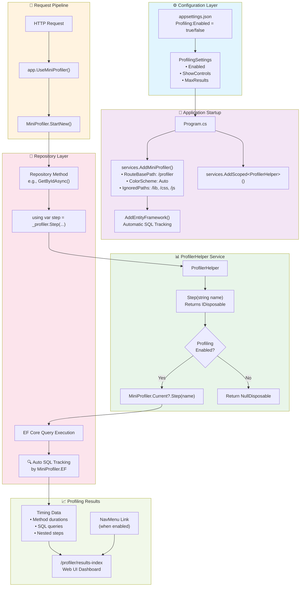
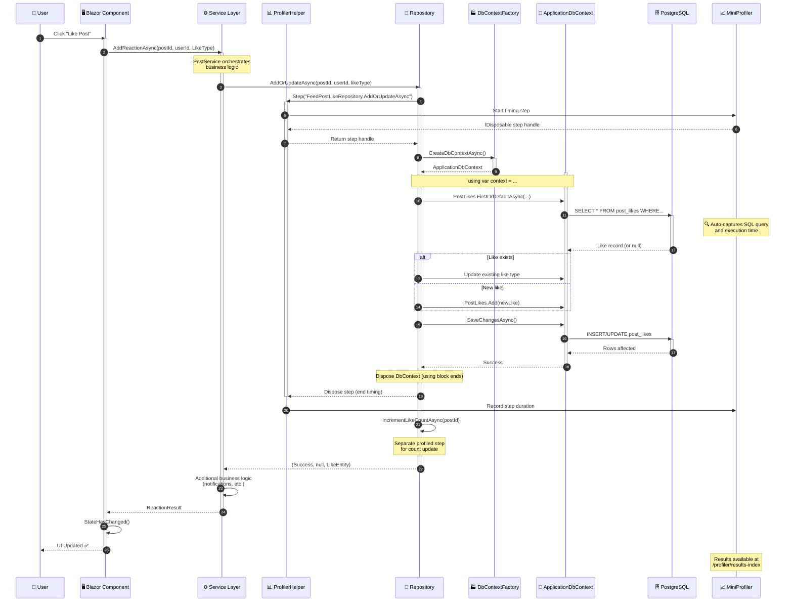

# FreeSpeak Application Architecture Diagrams

This document contains Mermaid diagrams illustrating the architecture of the FreeSpeak social platform.

---

## 1. Repository Layer Architecture

Shows all 17 repositories organized by domain, their abstractions (interfaces), and shared dependencies.

```mermaid
classDiagram
    direction TB

    %% Base Dependencies
    class IDbContextFactory~ApplicationDbContext~ {
        <<interface>>
        +CreateDbContextAsync() Task~ApplicationDbContext~
    }

    class ProfilerHelper {
        +Step(name: string) IDisposable
    }

    class ILogger~T~ {
        <<interface>>
        +LogError()
        +LogInformation()
    }

    %% Feed Domain Repositories
    namespace FeedDomain {
        class IFeedPostRepository~Post_PostImage~ {
            <<interface>>
            +GetByIdAsync()
            +CreateAsync()
            +DeleteAsync()
            +GetFeedPostsAsync()
        }

        class IFeedCommentRepository {
            <<interface>>
            +GetByIdAsync()
            +AddAsync()
            +DeleteAsync()
            +GetTopLevelCommentsAsync()
        }

        class IFeedPostLikeRepository {
            <<interface>>
            +AddOrUpdateAsync()
            +RemoveAsync()
            +GetCountsByTypeAsync()
        }

        class IFeedCommentLikeRepository {
            <<interface>>
            +AddOrUpdateAsync()
            +RemoveAsync()
            +GetCountsByTypeAsync()
        }

        class PostRepository {
            -_contextFactory
            -_logger
            -_profiler
            -_friendshipCache
        }

        class FeedCommentRepository {
            -_contextFactory
            -_logger
            -_profiler
            -_auditLogRepository
        }

        class FeedPostLikeRepository {
            -_contextFactory
            -_logger
            -_profiler
        }

        class FeedCommentLikeRepository {
            -_contextFactory
            -_logger
            -_profiler
        }
    }

    %% Group Domain Repositories
    namespace GroupDomain {
        class IGroupRepository {
            <<interface>>
            +GetByIdAsync()
            +AddAsync()
            +SearchGroupsAsync()
        }

        class IGroupPostRepository~GroupPost_GroupPostImage~ {
            <<interface>>
            +GetByIdAsync()
            +CreateAsync()
            +GetByGroupAsync()
        }

        class IGroupCommentRepository {
            <<interface>>
            +GetByIdAsync()
            +AddAsync()
            +GetCommentsForPostAsync()
        }

        class IGroupMemberRepository {
            <<interface>>
            +GetMembershipAsync()
            +IsMemberAsync()
            +IsAdminAsync()
        }

        class IGroupFileRepository {
            <<interface>>
            +GetByIdAsync()
            +AddAsync()
            +ApproveFileAsync()
        }

        class IGroupPostLikeRepository {
            <<interface>>
            +AddOrUpdateAsync()
            +RemoveAsync()
        }

        class IGroupCommentLikeRepository {
            <<interface>>
            +AddOrUpdateAsync()
            +RemoveAsync()
        }

        class GroupRepository
        class GroupPostRepository
        class GroupCommentRepository
        class GroupMemberRepository
        class GroupFileRepository
        class GroupPostLikeRepository
        class GroupCommentLikeRepository
    }

    %% User Domain Repositories
    namespace UserDomain {
        class IUserRepository {
            <<interface>>
            +GetByIdAsync()
            +SearchUsersAsync()
            +UpdateProfileAsync()
        }

        class IFriendshipRepository {
            <<interface>>
            +GetFriendsAsync()
            +SendRequestAsync()
            +AcceptRequestAsync()
        }

        class INotificationRepository {
            <<interface>>
            +GetUserNotificationsAsync()
            +MarkAsReadAsync()
            +AddAsync()
        }

        class UserRepository
        class FriendshipRepository
        class NotificationRepository
    }

    %% Utility Repositories
    namespace UtilityDomain {
        class IAuditLogRepository {
            <<interface>>
            +LogActionAsync()
            +GetUserAuditLogsAsync()
        }

        class IPinnedPostRepository {
            <<interface>>
            +IsPostPinnedAsync()
            +AddAsync()
        }

        class IPostNotificationMuteRepository {
            <<interface>>
            +IsPostMutedAsync()
            +AddAsync()
        }

        class AuditLogRepository
        class PinnedPostRepository
        class PostNotificationMuteRepository
    }

    %% Relationships - Implementations
    PostRepository ..|> IFeedPostRepository~Post_PostImage~
    FeedCommentRepository ..|> IFeedCommentRepository
    FeedPostLikeRepository ..|> IFeedPostLikeRepository
    FeedCommentLikeRepository ..|> IFeedCommentLikeRepository

    GroupRepository ..|> IGroupRepository
    GroupPostRepository ..|> IGroupPostRepository~GroupPost_GroupPostImage~
    GroupCommentRepository ..|> IGroupCommentRepository
    GroupMemberRepository ..|> IGroupMemberRepository
    GroupFileRepository ..|> IGroupFileRepository
    GroupPostLikeRepository ..|> IGroupPostLikeRepository
    GroupCommentLikeRepository ..|> IGroupCommentLikeRepository

    UserRepository ..|> IUserRepository
    FriendshipRepository ..|> IFriendshipRepository
    NotificationRepository ..|> INotificationRepository

    AuditLogRepository ..|> IAuditLogRepository
    PinnedPostRepository ..|> IPinnedPostRepository
    PostNotificationMuteRepository ..|> IPostNotificationMuteRepository

    %% Dependencies
    PostRepository --> IDbContextFactory~ApplicationDbContext~
    PostRepository --> ProfilerHelper
    PostRepository --> ILogger~T~

    FeedCommentRepository --> IDbContextFactory~ApplicationDbContext~
    FeedCommentRepository --> ProfilerHelper
    FeedCommentRepository --> IAuditLogRepository
```



---

## 2. Profiling Flow - MiniProfiler Integration

Shows how MiniProfiler integrates with the application through ProfilerHelper and tracks operations.



---

## 3. Service-Repository-Database Flow

Shows the complete request lifecycle from Blazor component through all layers.



---

## 4. Component Diagram - Blazor Components, Services, Repositories

Shows the relationships between UI components, services, and data access layers.

```mermaid
flowchart TB
    subgraph UI["🖥️ Blazor Components Layer"]
        direction TB

        subgraph Pages["Pages"]
            HomePage["HomePage.razor"]
            FriendsPage["FriendsPage.razor"]
            GroupsPage["GroupsPage.razor"]
            GroupPage["GroupPage.razor"]
            NotificationsPage["Notifications.razor"]
            ProfilePage["Account/Manage"]
        end

        subgraph SharedComponents["Shared Components"]
            PostCard["PostCard.razor"]
            CommentSection["CommentSection.razor"]
            ReactionPicker["ReactionPicker.razor"]
            PostCreator["PostCreator.razor"]
            GroupPostCreator["GroupPostCreator.razor"]
            NotificationBadge["NotificationBadge.razor"]
            NavMenu["NavMenu.razor"]
        end

        subgraph Layout["Layout"]
            MainLayout["MainLayout.razor"]
            ThemeSelector["ThemeSelector.razor"]
        end
    end

    subgraph Services["⚙️ Services Layer"]
        direction TB

        subgraph CoreServices["Core Services"]
            PostService["PostService"]
            FriendsService["FriendsService"]
            GroupService["GroupService"]
            GroupPostService["GroupPostService"]
            NotificationService["NotificationService"]
        end

        subgraph SupportServices["Support Services"]
            ImageUploadService["ImageUploadService"]
            ProfilePictureService["ProfilePictureService"]
            ThemeService["ThemeService"]
            UserPreferenceService["UserPreferenceService"]
            FriendshipCacheService["FriendshipCacheService"]
        end

        subgraph SecurityServices["Security Services"]
            RoleService["RoleService"]
            GroupAccessValidator["GroupAccessValidator"]
            FileSignatureValidator["FileSignatureValidator"]
            VirusScanService["VirusScanService"]
        end

        subgraph ProfilingServices["Profiling"]
            ProfilerHelper2["ProfilerHelper"]
        end
    end

    subgraph Repositories["📁 Repository Layer"]
        direction TB

        subgraph FeedRepos["Feed Repositories"]
            PostRepo["PostRepository"]
            FeedCommentRepo["FeedCommentRepository"]
            FeedPostLikeRepo["FeedPostLikeRepository"]
            FeedCommentLikeRepo["FeedCommentLikeRepository"]
        end

        subgraph GroupRepos["Group Repositories"]
            GroupRepo["GroupRepository"]
            GroupPostRepo["GroupPostRepository"]
            GroupCommentRepo["GroupCommentRepository"]
            GroupMemberRepo["GroupMemberRepository"]
            GroupFileRepo["GroupFileRepository"]
            GroupPostLikeRepo["GroupPostLikeRepository"]
            GroupCommentLikeRepo["GroupCommentLikeRepository"]
        end

        subgraph UserRepos["User Repositories"]
            UserRepo["UserRepository"]
            FriendshipRepo["FriendshipRepository"]
            NotificationRepo["NotificationRepository"]
        end

        subgraph UtilRepos["Utility Repositories"]
            AuditLogRepo["AuditLogRepository"]
            PinnedPostRepo["PinnedPostRepository"]
            MuteRepo["PostNotificationMuteRepository"]
        end
    end

    subgraph Data["💾 Data Layer"]
        DbContextFactory["IDbContextFactory<br/>&lt;ApplicationDbContext&gt;"]
        DbContext["ApplicationDbContext"]
        PostgreSQL[("PostgreSQL<br/>Database")]
    end

    subgraph Profiling["📊 MiniProfiler"]
        MiniProfilerCore["MiniProfiler.Current"]
        EFProfiler["MiniProfiler.EF"]
        ProfilerUI["/profiler/results-index"]
    end

    %% UI to Services
    HomePage --> PostService
    HomePage --> FriendsService
    PostCard --> PostService
    CommentSection --> PostService
    ReactionPicker --> PostService
    FriendsPage --> FriendsService
    GroupsPage --> GroupService
    GroupPage --> GroupPostService
    GroupPage --> GroupService
    NotificationsPage --> NotificationService
    NavMenu --> NotificationService

    %% Services to Repositories
    PostService --> PostRepo
    PostService --> FeedCommentRepo
    PostService --> FeedPostLikeRepo
    PostService --> FeedCommentLikeRepo
    PostService --> PinnedPostRepo

    FriendsService --> FriendshipRepo
    FriendsService --> UserRepo
    FriendsService --> NotificationRepo

    GroupService --> GroupRepo
    GroupService --> GroupMemberRepo

    GroupPostService --> GroupPostRepo
    GroupPostService --> GroupCommentRepo
    GroupPostService --> GroupPostLikeRepo
    GroupPostService --> GroupCommentLikeRepo

    NotificationService --> NotificationRepo

    %% All Repositories use ProfilerHelper
    PostRepo -.-> ProfilerHelper2
    FeedCommentRepo -.-> ProfilerHelper2
    FeedPostLikeRepo -.-> ProfilerHelper2
    GroupRepo -.-> ProfilerHelper2
    GroupPostRepo -.-> ProfilerHelper2
    FriendshipRepo -.-> ProfilerHelper2
    NotificationRepo -.-> ProfilerHelper2

    %% Repositories to Data
    PostRepo --> DbContextFactory
    FeedCommentRepo --> DbContextFactory
    GroupRepo --> DbContextFactory
    GroupPostRepo --> DbContextFactory
    FriendshipRepo --> DbContextFactory
    UserRepo --> DbContextFactory
    NotificationRepo --> DbContextFactory

    DbContextFactory --> DbContext
    DbContext --> PostgreSQL

    %% Profiling connections
    ProfilerHelper2 --> MiniProfilerCore
    DbContext -.-> EFProfiler
    EFProfiler --> MiniProfilerCore
    MiniProfilerCore --> ProfilerUI
    NavMenu -.->|"when enabled"| ProfilerUI

    %% Styling
    style UI fill:#e3f2fd
    style Services fill:#f3e5f5
    style Repositories fill:#e8f5e9
    style Data fill:#fff3e0
    style Profiling fill:#ffebee
```



---

## 5. Dependency Graph - Package/Project Dependencies

Shows NuGet package dependencies and project references across the solution.

```mermaid
flowchart TB
    subgraph Solution["📦 FreeSpeak Solution"]
        direction TB

        subgraph MainProject["FreeSpeakWeb (Main Application)"]
            FreeSpeakWeb["FreeSpeakWeb.csproj<br/>.NET 10 Blazor Server"]
        end

        subgraph TestProjects["Test Projects"]
            UnitTests["FreeSpeakWeb.Tests<br/>Unit Tests"]
            IntegrationTests["FreeSpeakWeb.IntegrationTests<br/>Integration Tests"]
            PerfTests["FreeSpeakWeb.PerformanceTests<br/>Benchmarks"]
        end
    end

    subgraph FrameworkPackages["🏗️ Framework Packages"]
        ASPNET["Microsoft.AspNetCore.*<br/>10.0.x"]
        EFCore["Microsoft.EntityFrameworkCore<br/>10.0.x"]
        Identity["Microsoft.AspNetCore.Identity<br/>10.0.x"]
        Localization["Microsoft.Extensions.Localization<br/>10.0.x"]
    end

    subgraph DatabasePackages["🗄️ Database Packages"]
        Npgsql["Npgsql.EntityFrameworkCore.PostgreSQL<br/>10.0.0"]
        EFTools["Microsoft.EntityFrameworkCore.Tools<br/>10.0.x"]
    end

    subgraph CachingPackages["⚡ Caching Packages"]
        Redis["Microsoft.Extensions.Caching<br/>.StackExchangeRedis<br/>10.0.x"]
        MemoryCache["Microsoft.Extensions.Caching<br/>.Memory<br/>10.0.x"]
    end

    subgraph ProfilingPackages["📊 Profiling Packages"]
        MiniProfilerMvc["MiniProfiler.AspNetCore.Mvc<br/>4.3.8"]
        MiniProfilerEF["MiniProfiler.EntityFrameworkCore<br/>4.3.8"]
    end

    subgraph ImagePackages["🖼️ Image Processing"]
        ImageSharp["SixLabors.ImageSharp<br/>3.1.x"]
    end

    subgraph SecurityPackages["🔒 Security Packages"]
        HtmlSanitizer["HtmlSanitizer<br/>9.0.x"]
        QRCode["Net.Codecrete.QrCodeGenerator<br/>2.1.0"]
        nClam["nClam<br/>9.0.0"]
    end

    subgraph TestPackages["🧪 Testing Packages"]
        xUnit["xUnit<br/>2.9.x"]
        bUnit["bUnit<br/>1.35.x"]
        Moq["Moq<br/>4.20.x"]
        FluentAssertions["FluentAssertions<br/>7.0.x"]
        EFInMemory["Microsoft.EntityFrameworkCore<br/>.InMemory<br/>10.0.x"]
        TestContainers["Testcontainers.PostgreSql<br/>4.1.0"]
        BenchmarkDotNet["BenchmarkDotNet<br/>0.14.0"]
    end

    %% Main Project Dependencies
    FreeSpeakWeb --> ASPNET
    FreeSpeakWeb --> EFCore
    FreeSpeakWeb --> Identity
    FreeSpeakWeb --> Localization
    FreeSpeakWeb --> Npgsql
    FreeSpeakWeb --> EFTools
    FreeSpeakWeb --> Redis
    FreeSpeakWeb --> MemoryCache
    FreeSpeakWeb --> MiniProfilerMvc
    FreeSpeakWeb --> MiniProfilerEF
    FreeSpeakWeb --> ImageSharp
    FreeSpeakWeb --> HtmlSanitizer
    FreeSpeakWeb --> QRCode
    FreeSpeakWeb --> nClam

    %% Test Project Dependencies
    UnitTests --> FreeSpeakWeb
    UnitTests --> xUnit
    UnitTests --> bUnit
    UnitTests --> Moq
    UnitTests --> FluentAssertions
    UnitTests --> EFInMemory

    IntegrationTests --> FreeSpeakWeb
    IntegrationTests --> xUnit
    IntegrationTests --> TestContainers
    IntegrationTests --> FluentAssertions

    PerfTests --> FreeSpeakWeb
    PerfTests --> BenchmarkDotNet

    %% Package Dependencies
    MiniProfilerMvc --> MiniProfilerEF
    Npgsql --> EFCore
    Identity --> ASPNET

    %% Styling
    style MainProject fill:#e8f5e9
    style TestProjects fill:#fff3e0
    style FrameworkPackages fill:#e3f2fd
    style DatabasePackages fill:#fce4ec
    style CachingPackages fill:#f3e5f5
    style ProfilingPackages fill:#ffebee
    style ImagePackages fill:#e0f2f1
    style SecurityPackages fill:#fff8e1
    style TestPackages fill:#f5f5f5
```



---

## 6. Database Schema - Entity Relationships

Shows the PostgreSQL database entities and their relationships.

```mermaid
erDiagram
    %% User Domain
    ApplicationUser ||--o{ Post : "authors"
    ApplicationUser ||--o{ Comment : "authors"
    ApplicationUser ||--o{ PostLike : "creates"
    ApplicationUser ||--o{ CommentLike : "creates"
    ApplicationUser ||--o{ Friendship : "initiates"
    ApplicationUser ||--o{ Friendship : "receives"
    ApplicationUser ||--o{ UserNotification : "receives"
    ApplicationUser ||--o{ GroupUser : "joins"
    ApplicationUser ||--o{ PinnedPost : "pins"
    ApplicationUser ||--o{ PostNotificationMute : "mutes"
    ApplicationUser ||--o{ AuditLog : "generates"
    ApplicationUser ||--o{ UserPreference : "configures"

    ApplicationUser {
        string Id PK
        string UserName UK
        string Email UK
        string FirstName
        string LastName
        string ProfilePictureUrl
        string Bio
        datetime CreatedAt
        datetime LastActiveAt
        bool EmailConfirmed
        bool TwoFactorEnabled
    }

    %% Feed Posts
    Post ||--o{ PostImage : "contains"
    Post ||--o{ Comment : "has"
    Post ||--o{ PostLike : "receives"
    Post ||--o{ PinnedPost : "pinned_by"
    Post ||--o{ PostNotificationMute : "muted_by"

    Post {
        int Id PK
        string AuthorId FK
        string Content
        int LikeCount
        int CommentCount
        int ShareCount
        enum AudienceType
        enum PostStatus
        datetime CreatedAt
        datetime UpdatedAt
    }

    PostImage {
        int Id PK
        int PostId FK
        string ImageUrl
        int DisplayOrder
        datetime UploadedAt
    }

    %% Comments
    Comment ||--o{ Comment : "replies_to"
    Comment ||--o{ CommentLike : "receives"

    Comment {
        int Id PK
        int PostId FK
        string AuthorId FK
        int ParentCommentId FK
        string Content
        string ImageUrl
        int LikeCount
        datetime CreatedAt
    }

    %% Likes
    PostLike {
        int Id PK
        int PostId FK
        string UserId FK
        enum LikeType
        datetime CreatedAt
    }

    CommentLike {
        int Id PK
        int CommentId FK
        string UserId FK
        enum LikeType
        datetime CreatedAt
    }

    %% Friendships
    Friendship {
        int Id PK
        string RequesterId FK
        string AddresseeId FK
        enum FriendshipStatus
        datetime CreatedAt
        datetime AcceptedAt
    }

    %% Notifications
    UserNotification {
        int Id PK
        string UserId FK
        enum NotificationType
        string Title
        string Message
        string Data
        bool IsRead
        datetime CreatedAt
        datetime ExpiresAt
    }

    %% Groups
    Group ||--o{ GroupUser : "has_members"
    Group ||--o{ GroupPost : "contains"
    Group ||--o{ GroupFile : "stores"
    Group ||--o{ GroupRule : "defines"

    Group {
        int Id PK
        string Name
        string Description
        string CreatorId FK
        string HeaderImageUrl
        bool IsPublic
        bool RequiresApproval
        int MemberCount
        datetime CreatedAt
        datetime LastActiveAt
    }

    GroupUser {
        int Id PK
        int GroupId FK
        string UserId FK
        bool IsAdmin
        bool IsModerator
        int GroupPoints
        int PostCount
        datetime JoinedAt
        datetime LastActiveAt
    }

    %% Group Posts
    GroupPost ||--o{ GroupPostImage : "contains"
    GroupPost ||--o{ GroupPostComment : "has"
    GroupPost ||--o{ GroupPostLike : "receives"

    GroupPost {
        int Id PK
        int GroupId FK
        string AuthorId FK
        string Content
        int LikeCount
        int CommentCount
        int ShareCount
        enum PostStatus
        datetime CreatedAt
        datetime UpdatedAt
    }

    GroupPostImage {
        int Id PK
        int PostId FK
        string ImageUrl
        int DisplayOrder
        datetime UploadedAt
    }

    %% Group Comments
    GroupPostComment ||--o{ GroupPostComment : "replies_to"
    GroupPostComment ||--o{ GroupPostCommentLike : "receives"

    GroupPostComment {
        int Id PK
        int PostId FK
        string AuthorId FK
        int ParentCommentId FK
        string Content
        string ImageUrl
        int LikeCount
        datetime CreatedAt
    }

    %% Group Likes
    GroupPostLike {
        int Id PK
        int PostId FK
        string UserId FK
        enum LikeType
        datetime CreatedAt
    }

    GroupPostCommentLike {
        int Id PK
        int CommentId FK
        string UserId FK
        enum LikeType
        datetime CreatedAt
    }

    %% Group Files
    GroupFile {
        int Id PK
        int GroupId FK
        string UploaderId FK
        string FileName
        string FilePath
        string ContentType
        long FileSize
        enum ApprovalStatus
        string ApproverId FK
        int DownloadCount
        bool VirusScanned
        bool IsSafe
        datetime UploadedAt
        datetime ApprovedAt
    }

    GroupRule {
        int Id PK
        int GroupId FK
        string Title
        string Description
        int DisplayOrder
    }

    %% Utility Tables
    PinnedPost {
        int Id PK
        int PostId FK
        string UserId FK
        datetime PinnedAt
    }

    PostNotificationMute {
        int Id PK
        int PostId FK
        string UserId FK
        datetime MutedAt
    }

    AuditLog {
        int Id PK
        string UserId FK
        string ActionCategory
        string ActionDetails
        datetime Timestamp
        string IpAddress
    }

    UserPreference {
        int Id PK
        string UserId FK
        string PreferenceKey
        string PreferenceValue
        datetime UpdatedAt
    }
```



---

## 7. Deployment Diagram - Infrastructure Layout

Shows the infrastructure and deployment architecture for different environments.

```mermaid
flowchart TB
    subgraph Users["👥 Users"]
        Browser["🌐 Web Browser"]
        Mobile["📱 Mobile Browser"]
    end

    subgraph CDN["🌍 CDN Layer (Optional)"]
        CloudCDN["Azure CDN / Cloudflare<br/>Static Assets Caching"]
    end

    subgraph LoadBalancer["⚖️ Load Balancing"]
        LB["Azure Load Balancer /<br/>NGINX Reverse Proxy"]
    end

    subgraph AppServers["🖥️ Application Servers"]
        direction TB

        subgraph Server1["App Server 1"]
            Kestrel1["Kestrel Web Server"]
            Blazor1["Blazor Server<br/>SignalR Hub"]
            App1["FreeSpeakWeb<br/>.NET 10 Runtime"]
        end

        subgraph Server2["App Server 2"]
            Kestrel2["Kestrel Web Server"]
            Blazor2["Blazor Server<br/>SignalR Hub"]
            App2["FreeSpeakWeb<br/>.NET 10 Runtime"]
        end

        subgraph ServerN["App Server N..."]
            KestrelN["Kestrel Web Server"]
            BlazorN["Blazor Server<br/>SignalR Hub"]
            AppN["FreeSpeakWeb<br/>.NET 10 Runtime"]
        end
    end

    subgraph Caching["⚡ Caching Layer"]
        direction LR

        subgraph InMemory["In-Memory Cache<br/>(Single Server)"]
            MemCache["IMemoryCache<br/>Local Cache"]
        end

        subgraph Distributed["Distributed Cache<br/>(Multi-Server)"]
            Redis1["Redis Primary"]
            Redis2["Redis Replica"]
        end
    end

    subgraph Database["🗄️ Database Layer"]
        direction TB

        subgraph PgCluster["PostgreSQL Cluster"]
            PgPrimary[("PostgreSQL Primary<br/>Read/Write")]
            PgReplica1[("PostgreSQL Replica 1<br/>Read-Only")]
            PgReplica2[("PostgreSQL Replica 2<br/>Read-Only")]
        end

        PgPrimary -->|"Streaming<br/>Replication"| PgReplica1
        PgPrimary -->|"Streaming<br/>Replication"| PgReplica2
    end

    subgraph Storage["📁 File Storage"]
        direction LR

        subgraph LocalStorage["Local Storage<br/>(Development)"]
            LocalFiles["Local File System<br/>/app/uploads"]
        end

        subgraph CloudStorage["Cloud Storage<br/>(Production)"]
            BlobStorage["Azure Blob Storage /<br/>AWS S3"]
        end
    end

    subgraph Security["🔒 Security Services"]
        direction LR
        ClamAV["ClamAV<br/>Virus Scanner"]
        SSL["SSL/TLS<br/>Certificates"]
    end

    subgraph Monitoring["📊 Monitoring & Observability"]
        direction LR
        MiniProfiler["MiniProfiler<br/>Performance"]
        AppInsights["Application Insights /<br/>Prometheus + Grafana"]
        Logging["Structured Logging<br/>Seq / ELK Stack"]
    end

    subgraph CI_CD["🔄 CI/CD Pipeline"]
        direction LR
        GitHub["GitHub<br/>Source Control"]
        Actions["GitHub Actions<br/>Build & Test"]
        Registry["Container Registry<br/>Docker Images"]
        Deploy["Deployment<br/>Azure / AWS / K8s"]
    end

    %% User Flow
    Browser --> CloudCDN
    Mobile --> CloudCDN
    CloudCDN --> LB
    LB --> Kestrel1
    LB --> Kestrel2
    LB --> KestrelN

    %% App to Cache
    App1 --> MemCache
    App1 --> Redis1
    App2 --> Redis1
    AppN --> Redis1
    Redis1 --> Redis2

    %% App to Database
    App1 --> PgPrimary
    App1 -.->|"Read Queries"| PgReplica1
    App2 --> PgPrimary
    App2 -.->|"Read Queries"| PgReplica2
    AppN --> PgPrimary

    %% App to Storage
    App1 --> LocalFiles
    App1 --> BlobStorage
    App2 --> BlobStorage

    %% Security
    App1 --> ClamAV
    LB --> SSL

    %% Monitoring
    App1 -.-> MiniProfiler
    App1 -.-> AppInsights
    App1 -.-> Logging
    App2 -.-> AppInsights
    AppN -.-> AppInsights

    %% CI/CD Flow
    GitHub --> Actions
    Actions --> Registry
    Registry --> Deploy
    Deploy --> Server1
    Deploy --> Server2
    Deploy --> ServerN

    %% Styling
    style Users fill:#e3f2fd
    style CDN fill:#f3e5f5
    style LoadBalancer fill:#fff3e0
    style AppServers fill:#e8f5e9
    style Caching fill:#fce4ec
    style Database fill:#e1f5fe
    style Storage fill:#f5f5f5
    style Security fill:#ffebee
    style Monitoring fill:#fff8e1
    style CI_CD fill:#e0f2f1
```



### Deployment Configurations

#### Development Environment
```
┌─────────────────────────────────────────────────────────┐
│  Developer Machine                                       │
│  ┌─────────────────┐  ┌─────────────────┐               │
│  │ Visual Studio   │  │ Docker Desktop  │               │
│  │ + Hot Reload    │  │ (PostgreSQL)    │               │
│  └────────┬────────┘  └────────┬────────┘               │
│           │                     │                        │
│  ┌────────▼─────────────────────▼────────┐              │
│  │        Kestrel (localhost:7025)        │              │
│  │  ┌─────────────────────────────────┐  │              │
│  │  │  FreeSpeakWeb + MiniProfiler    │  │              │
│  │  │  In-Memory Cache                │  │              │
│  │  │  Local File Storage             │  │              │
│  │  └─────────────────────────────────┘  │              │
│  └───────────────────────────────────────┘              │
└─────────────────────────────────────────────────────────┘
```

#### Production Environment (Azure)
```
┌──────────────────────────────────────────────────────────────────┐
│  Azure Cloud                                                      │
│                                                                   │
│  ┌──────────────┐    ┌───────────────────────────────────────┐  │
│  │ Azure Front  │    │  Azure App Service Plan (Premium)     │  │
│  │ Door / CDN   │───▶│  ┌─────────────┐  ┌─────────────┐    │  │
│  └──────────────┘    │  │ Instance 1  │  │ Instance 2  │    │  │
│                      │  │ (2 vCPU)    │  │ (2 vCPU)    │    │  │
│                      │  └──────┬──────┘  └──────┬──────┘    │  │
│                      └─────────┼────────────────┼────────────┘  │
│                                │                │                │
│  ┌─────────────────────────────┼────────────────┼─────────────┐ │
│  │                             ▼                ▼              │ │
│  │  ┌─────────────────┐  ┌─────────────────────────────────┐ │ │
│  │  │ Azure Cache for │  │ Azure Database for PostgreSQL   │ │ │
│  │  │ Redis (P1)      │  │ Flexible Server (GP, 4 vCores) │ │ │
│  │  └─────────────────┘  └─────────────────────────────────┘ │ │
│  │                                                            │ │
│  │  ┌─────────────────────────────────────────────────────┐  │ │
│  │  │ Azure Blob Storage (Hot Tier) - User Uploads        │  │ │
│  │  └─────────────────────────────────────────────────────┘  │ │
│  └────────────────────────────────────────────────────────────┘ │
└──────────────────────────────────────────────────────────────────┘
```

---

## Summary Statistics

| Layer | Count | Description |
|-------|-------|-------------|
| **Repositories** | 17 | Data access implementations |
| **Repository Interfaces** | 17 | Abstractions for DI |
| **Profiled Methods** | ~200+ | All async repository methods |
| **Services** | 15+ | Business logic layer |
| **Blazor Components** | 50+ | UI components |
| **Database Tables** | 25+ | PostgreSQL entities |
| **NuGet Packages** | 30+ | Third-party dependencies |

## Key Architecture Patterns

1. **Repository Pattern** - All data access through repository interfaces
2. **Dependency Injection** - Constructor injection throughout
3. **Factory Pattern** - `IDbContextFactory` for short-lived DbContext instances
4. **Decorator Pattern** - ProfilerHelper wraps MiniProfiler for conditional profiling
5. **Options Pattern** - Configuration via `IOptions<T>` (ProfilingSettings, SiteSettings)
6. **Unit of Work** - DbContext manages transaction boundaries
7. **CQRS-lite** - Separate read (projections) and write paths in repositories

## Database Design Principles

- **Soft Deletes** - Posts use `PostStatus` enum instead of hard deletes
- **Denormalized Counts** - `LikeCount`, `CommentCount` on posts for performance
- **Audit Trail** - `AuditLog` table for security-sensitive actions
- **Flexible Schema** - `UserPreference` key-value pairs for extensibility

## Profiling Coverage

All 17 repositories are instrumented with ProfilerHelper:
- ✅ FeedCommentRepository (17 methods)
- ✅ FeedPostLikeRepository (9 methods)
- ✅ FeedCommentLikeRepository (10 methods)
- ✅ FriendshipRepository (17 methods)
- ✅ GroupCommentRepository (17 methods)
- ✅ GroupFileRepository (22 methods)
- ✅ GroupMemberRepository (23 methods)
- ✅ GroupPostLikeRepository (12 methods)
- ✅ GroupPostRepository (23 methods)
- ✅ GroupRepository (16 methods)
- ✅ NotificationRepository (16 methods)
- ✅ PinnedPostRepository (12 methods)
- ✅ PostNotificationMuteRepository (12 methods)
- ✅ PostRepository (22 methods)
- ✅ UserRepository (11 methods)
- ✅ AuditLogRepository (6 methods)
- ✅ GroupCommentLikeRepository (10 methods)

## Deployment Options

| Environment | Database | Cache | Storage | Scaling |
|-------------|----------|-------|---------|---------|
| **Development** | Docker PostgreSQL | In-Memory | Local FS | Single Instance |
| **Staging** | Azure PostgreSQL | Redis | Blob Storage | 2 Instances |
| **Production** | PostgreSQL + Replicas | Redis Cluster | Blob Storage + CDN | Auto-scale |

---

*Generated: January 2025*
*FreeSpeak Social Platform - .NET 10 / Blazor*
*Repository: https://github.com/ScottShaver/FreeSpeak*
